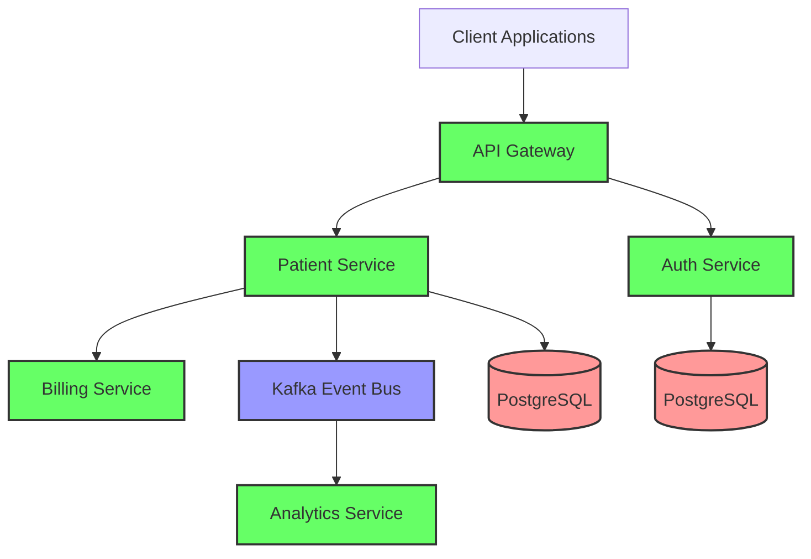
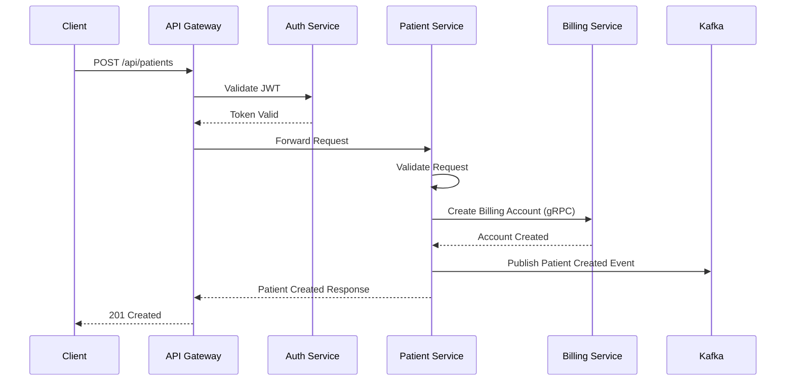

# Patient Management System

A modern, microservices-based healthcare management system built with Spring Boot and cloud-native technologies.

## 🏗 Architecture

### System Architecture Diagram



### Create Patient Sequence Diagram



The system is composed of the following microservices:

### Core Services

- **Patient Service** (Port: 4000)

  - Manages patient records and information
  - Communicates with Billing Service via gRPC
  - Produces events to Kafka for analytics
  - Uses PostgreSQL for data persistence

- **Billing Service** (Ports: 4001, 9001)

  - Handles billing accounts and transactions
  - Exposes gRPC interface for inter-service communication
  - Creates billing accounts for new patients

- **Auth Service** (Port: 4005)

  - Manages user authentication and authorization
  - Implements JWT-based security
  - Uses PostgreSQL for user data storage

- **Analytics Service** (Port: 4002)
  - Consumes patient events from Kafka
  - Processes and analyzes patient data
  - Provides insights and reporting capabilities

### Infrastructure Services

- **API Gateway** (Port: 4004)
  - Routes requests to appropriate services
  - Implements JWT validation
  - Handles API documentation routing

### Integration & Testing

- **Integration Tests**
  - End-to-end testing of service interactions
  - Authentication flow validation
  - API endpoint testing

## 🛠 Technologies

- **Framework**: Spring Boot 3.5.4
- **Language**: Java 21
- **APIs**: REST, gRPC
- **Security**: JWT, Spring Security
- **Documentation**: OpenAPI (Swagger)
- **Message Broker**: Apache Kafka
- **Database**: PostgreSQL
- **Testing**: JUnit, Rest Assured
- **Infrastructure**: Docker
- **Cloud**: AWS (LocalStack for development)

## 🚀 Getting Started

### Service Configuration

#### Environment Variables

**Patient Service**

```properties
# Debug Configuration
JAVA_TOOL_OPTIONS=-agentlib:jdwp=transport=dt_socket,server=y,suspend=n,address=*:5005

# Database Configuration
SPRING_DATASOURCE_URL=jdbc:postgresql://patient-service-db:5432/db
SPRING_DATASOURCE_USERNAME=admin_user
SPRING_DATASOURCE_PASSWORD=password
SPRING_JPA_HIBERNATE_DDL_AUTO=update
SPRING_SQL_INIT_MODE=always

# Kafka Configuration
SPRING_KAFKA_BOOTSTRAP_SERVERS=kafka:9092

# Billing Service Connection
BILLING_SERVICE_ADDRESS=billing-service
BILLING_SERVICE_GRPC_PORT=9005
```

**Auth Service**

```properties
# Database Configuration
SPRING_DATASOURCE_URL=jdbc:postgresql://auth-service-db:5432/db
SPRING_DATASOURCE_USERNAME=admin_user
SPRING_DATASOURCE_PASSWORD=password
SPRING_JPA_HIBERNATE_DDL_AUTO=update
SPRING_SQL_INIT_MODE=always
```

**Auth Service Database**

```properties
POSTGRES_DB=db
POSTGRES_USER=admin_user
POSTGRES_PASSWORD=password
```

**Analytics Service**

```properties
SPRING_KAFKA_BOOTSTRAP_SERVERS=kafka:9092
```

**Kafka Configuration**

```properties
KAFKA_CFG_ADVERTISED_LISTENERS=PLAINTEXT://kafka:9092,EXTERNAL://localhost:9094
KAFKA_CFG_CONTROLLER_LISTENER_NAMES=CONTROLLER
KAFKA_CFG_CONTROLLER_QUORUM_VOTERS=0@kafka:9093
KAFKA_CFG_LISTENER_SECURITY_PROTOCOL_MAP=CONTROLLER:PLAINTEXT,EXTERNAL:PLAINTEXT,PLAINTEXT:PLAINTEXT
KAFKA_CFG_LISTENERS=PLAINTEXT://:9092,CONTROLLER://:9093,EXTERNAL://:9094
KAFKA_CFG_NODE_ID=0
KAFKA_CFG_PROCESS_ROLES=controller,broker
```


### Running Locally

1. Clone the repository:

```bash
git clone https://github.com/rohithJatla/Patient_Management_System.git
cd Patient_Management_System
```

2. Start the infrastructure services:

```bash
docker-compose up -d kafka postgres
```

3. Build and start the services:

```bash
./mvnw clean package
docker-compose up -d
```

4. The services will be available at:
   - API Gateway: http://localhost:4004
   - Patient Service: http://localhost:4000
   - Billing Service: http://localhost:4001
   - Auth Service: http://localhost:4005
   - Analytics Service: http://localhost:4002

### API Documentation

- Patient Service: http://localhost:4000/swagger-ui.html
- Auth Service: http://localhost:4005/swagger-ui.html
- Postman Collection: [Patient Management System Collection](https://www.postman.com/material-participant-60005099/workspace/patient-management-systesm)

The Postman collection includes example requests for:

- User Authentication
- Patient CRUD Operations
- Health Checks
- API Documentation Endpoints

## 🔐 Security

The system implements a JWT-based authentication mechanism:

1. Users authenticate through the Auth Service
2. JWT tokens are validated at the API Gateway
3. Secured endpoints require valid JWT tokens

## 🔄 Service Communication

- **REST**: Used for external API communication
- **gRPC**: Internal communication between Patient and Billing services
- **Kafka**: Event-driven communication for analytics

## 🧪 Testing

Run integration tests:

```bash
cd Integration_test
./mvnw test
```

## 📦 Infrastructure as Code

The project includes AWS infrastructure code using AWS CDK:

- LocalStack for local development
- Deployment scripts for AWS services

## 👥 Contributing

1. Fork the repository
2. Create a feature branch
3. Commit your changes
4. Push to the branch
5. Create a Pull Request

## 📄 License

This project is licensed under the MIT License - see the LICENSE file for details.

## 🙏 Acknowledgments

- Spring Boot and Spring Cloud teams
- The gRPC team
- Apache Kafka team
